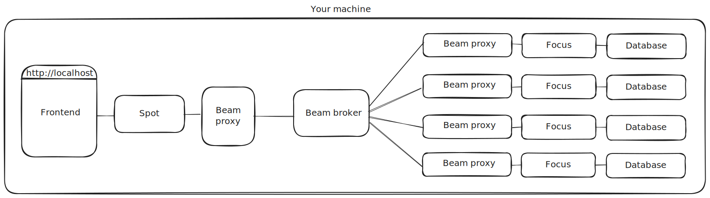
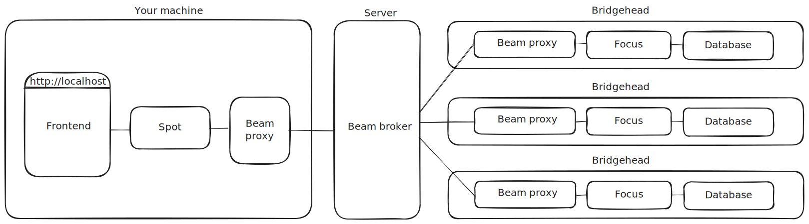

> I turn my headlights on and suddenly I can see

[](https://github.com/samply/headlights/actions/workflows/playwright.yml)

Headlights implements end-to-end testing of the federated search tools in the [Samply](https://github.com/samply/) organization. The repository is organized into project directories that contain a project README file, Docker Compose files, Playwright tests, and optionally synthetic data. You can get started by copying a command from one of the project README files. Note that running in bridgehead mode requires that you set up of a PKI directory and create a `.env.beam` file as described in the [bridgehead mode](#bridgehead-mode) section.

* [Local mode](#local-mode)
* [Bridgehead mode](#bridgehead-mode)
* [Emulating other environments using override files](#emulating-other-environments-using-override-files)
* [Running individual components from source](#running-individual-components-from-source)
* [Automated tests using Playwright](#automated-tests-using-playwright)

## Local mode



In local mode all components are running locally. This includes a local [Beam](https://github.com/samply/beam) network and a local database (typically [Blaze](https://github.com/samply/blaze)) that is filled with synthetic data. Projects supporting local mode have a `compose.local.yaml` file in their project directory. Run a project in local mode as follows:

```bash
docker compose -f [PROJECT DIRECTORY]/compose.local.yaml up --pull always
```

`compose.local.yaml` files use the `compose.localbeam.yaml` file in the root of the repository by including it:

```
include:
  - ../compose.localbeam.yaml
```

The `compose.localbeam.yaml` file brings up a local Beam network consisting of a Beam broker and the following Beam proxies:

| Service name | Beam proxy ID | Intended use | Host port | Configured apps |
| ----- | ----- | --- | --- | --- |
| `proxy1` | `proxy1.broker` | Connect frontend via Spot | `4001` | `spot`, `prism` |
| `proxy2` | `proxy2.broker` | Connect database via Focus | `4002` | `focus` |
| `proxy3` | `proxy3.broker` | Connect database via Focus (optional) | `4003` | `focus` |
| `proxy4` | `proxy4.broker` | Connect database via Focus (optional) | `4004` | `focus` |

All apps use the key `pass123` to connect to a local proxy.

## Bridgehead mode



In bridgehead mode data is fetched from real bridgeheads. This requires that you have a development proxy enrolled in the Beam network. Headlights requires that you organize your Beam keys in a PKI directory that contains one directory per Beam broker. Each broker directory must contain the broker root certificate in `root.crt.pem` and your private key in a file named after the proxy ID with the `.priv.pem` file extension. For example if your name is John your PKI directory may look as follows:

```
/home/john/pki
├── broker.bbmri.samply.de
│   ├── dev-john.priv.pem
│   └── root.crt.pem
└── broker.ccp-it.dktk.dkfz.de
    ├── dev-john.priv.pem
    └── root.crt.pem
```

In the root of the repository create the `.env.beam` file containing your development proxy ID and the path to your PKI directory. For example:

```
DEV_PROXY=dev-john
PKI_PATH=/home/john/pki
```

Now you are ready to use bridgehead mode. Projects supporting bridgehead mode have a `compose.bridgehead.yaml` file in their project directory. Run a project in bridgehead mode as follows:

```bash
docker compose -f [PROJECT DIRECTORY]/compose.bridgehead.yaml --env-file .env.beam up --pull always
```

`compose.bridgehead.yaml` files define the `proxy1` service that uses the private key from the PKI directory to connect to the Beam network. For example:

```yaml
  proxy1:
    image: samply/beam-proxy:main
    ports:
      - 4001:4001
    environment:
      BIND_ADDR: 0.0.0.0:4001
      BROKER_URL: https://broker.bbmri.samply.de
      PROXY_ID: ${DEV_PROXY}.broker.bbmri.samply.de
      PRIVKEY_FILE: /pki/${DEV_PROXY}.priv.pem
      ROOTCERT_FILE: /pki/root.crt.pem
      APP_spot_KEY: pass123
      APP_prism_KEY: pass123
    volumes:
      - ${PKI_PATH}/broker.bbmri.samply.de:/pki:ro
```

## Emulating other environments using override files

Projects can have more than one environment. The `compose.local.yaml` and `compose.bridgehead.yaml` files should emulate the production environment. Override files are used to emulate other environments. For example projects with a test environment have a `compose.local.test.yaml` or `compose.bridgehead.test.yaml` override file in their project directory. Use these as follows:

```bash
docker compose -f [PROJECT DIRECTORY]/compose.local.yaml -f [PROJECT DIRECTORY]/compose.local.test.yaml up --pull always
docker compose -f [PROJECT DIRECTORY]/compose.bridgehead.yaml -f [PROJECT DIRECTORY]/compose.bridgehead.test.yaml --env-file .env.beam up --pull always
```

Override files commonly override image tags, the Beam broker, and the sites to query. For example:

```yaml
services:
  bbmri-sample-locator:
    image: samply/bbmri-sample-locator:main
    environment:
      PUBLIC_ENVIRONMENT: test
  
  spot:
    image: samply/rustyspot:main
    environment:
      BEAM_APP_ID: spot.${DEV_PROXY}.broker-test.bbmri-test.samply.de
      SITES: eric-test,uppsala-test,lodz-test,DNB-Test

  proxy1:
    environment:
      BROKER_URL: https://broker-test.bbmri-test.samply.de
      PROXY_ID: ${DEV_PROXY}.broker-test.bbmri-test.samply.de
    volumes:
      - ${PKI_PATH}/broker-test.bbmri-test.samply.de:/pki:ro
```

## Running individual components from source

Headlights allows you to exclude a specific component from the Compose file and run it from source. You can get started quickly by copying the three commands for the component you want to run from source from the project README file.

Let's consider an example and look at the three steps in detail. Say we want to start a project in local mode and run Focus from source. The first step is to extract the environment variables of the `focus` service from the Compose file:

```bash
docker compose -f [PROJECT DIRECTORY]/compose.local.yaml config --format json | ./getenv focus
```

This requires that the `compose.local.yaml` file supports running the Focus component from source. All components that Focus connects to must be exposed to a port on the host and Focus must refer to them via `docker.host.internal`. For example:

```yaml
  focus:
    image: samply/focus:main
    depends_on:
      - proxy2
    extra_hosts:
      - host.docker.internal:host-gateway
    environment:
      BEAM_PROXY_URL: http://host.docker.internal:4002
      BEAM_APP_ID_LONG: focus.proxy2.broker
      API_KEY: pass123
      ENDPOINT_TYPE: blaze
      BLAZE_URL: http://host.docker.internal:8080/fhir/
      OBFUSCATE: no
```

The `getenv` script replaces `http://docker.host.internal` with `http://localhost` yielding a list of environment variables that can be used to run Focus on the host.

The second step is to run the Compose file excluding the `focus` service:

```
docker compose -f [PROJECT DIRECTORY]/compose.local.yaml up --pull always --scale focus=0
```

As a last step we can run Focus from source with the environment variables we obtained in the first step:

```
API_KEY='pass123' BEAM_APP_ID_LONG='focus.proxy2.broker' BEAM_PROXY_URL='http://localhost:4002' BLAZE_URL='http://localhost:8080/fhir/' ENDPOINT_TYPE='blaze' OBFUSCATE='no' cargo run
```

## Automated tests using Playwright

Headlights supports automated end-to-end testing using [Playwright](https://playwright.dev/). Playwright tests can run in three scenarios:

* Projects with automated tests include a `playwright` service in their `compose.local.yaml` file. When running a project in local mode the service runs the Playwright tests automatically and logs the results.
* GitHub Actions runs all Playwright tests nightly by starting the project in local mode and monitoring the exit code of the `playwright` service. GitHub Actions passes the environment variable `CI=true` which changes the Playwright configuration.
* You can install Playwright on your machine to run tests outside of Docker. This allows you to use [UI Mode](https://playwright.dev/docs/test-ui-mode) to develop and debug tests locally.

By convention projects place automated tests in a `playwright.spec.ts` file in their project directory.  Here is an example of a simple Playwright test:

```ts
test('table contains 256', async ({ page }) => {
  await page.goto('/search');
  await expect(page.getByRole('table')).toContainText('256');
});
```

Projects include a `playwright` container in their `compose.local.yaml` file. For example:

```yaml
  playwright:
    image: mcr.microsoft.com/playwright:v1.57.0-noble
    network_mode: host
    depends_on:
      test-data-loader:
        condition: service_completed_successfully
    environment:
      - CI=${CI}
    volumes:
      - ../playwright.config.ts:/test/playwright.config.ts:ro
      - ./playwright.spec.ts:/test/playwright.spec.ts:ro
    working_dir: /test
    command: bash -c 'npm i @playwright/test@1.57.0 && npx playwright test'
```

When writing new tests it is recommended to install Playwright on your machine for a better developer experience. To do so first run `npm install` in the root of the repository and then run `npx playwright install`. The latter will download browser binaries to your computer and install system dependencies. Playwright officially supports Windows, Mac and Ubuntu/Debian. On other Linux distributions it may fail to install system dependencies but it might still work. On Arch Linux for example, Chromium and Firefox tests work despite missing dependencies but Safari does not.

Once Playwright is installed on your machine you can use UI Mode:

```
npx playwright test --ui
```

In another terminal run a project in local mode and wait for it to be ready before triggering tests in the Playwright UI.
